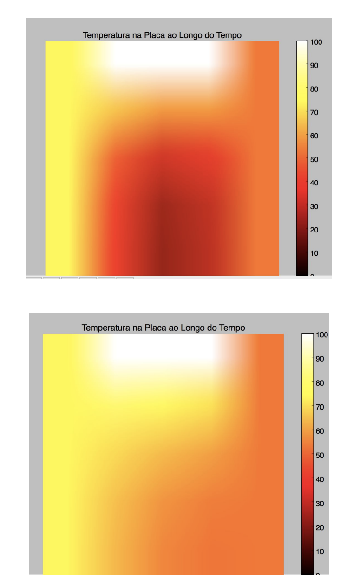

# Heated board

The second project for Insper's "Heat Transfer and Solids Mechanics" module consisted of making a thermal model simulation program on a board (two-dimensional surface). The group chose to use python with the NumPy library for optimized numerical manipulation and matplotlib for plotting the graphics.

## running the program

```
python3 run.py
```


## simulation values

The simulation values can be changed:

```

LEFT_TEMP = 0.0
RIGHT_TEMP = 100.0
BOT_TEMP = 0.0
TOP_TEMP = 0.0

FLUX_TOP = 0
FLUX_LEFT = 0
FLUX_RIGHT = None
FLUX_BOT = 0

T_TOTAL = 10
T_STEP = .1

LEN_X = 1
LEN_Y = 1
LEN_STEP = 0.1

MIN_MULT = .9
MAX_MULT = 1.1

K = .2
C = 4
D = 2
ALPHA = K/(C*D)
ERROR = 0.0

```

The first four variables correspond to the initial temperatures of the left, right, bottom, and top edges, respectively. The following four variables are the top, left, right, and bottom edge flows. The following two variables are the total simulation time size and its steps. Then, the dimensions of the board in meters are defined, and the step of mesh discretization. Finally, the board constants are defined: thermal conductivity, specific heat, and density. The last variable defined is the acceptable error. If the error associated with the value at a particular time is less than or equal to that, the calculation loop will be broken, considering that value ideal.

## results:

samples of simulations:



Created at 2017.1
